# Try Azure App Service Lab

## Overview

In this lab, you will quickly and easily create a new free App Service via the Try App Service experience, clone the app, make changes, then push the changes via Git deploy and see the updates in the browser.

## What You’ll Need

To complete this lab, you will need the following:

-   [A Microsoft account](https://signup.live.com/signup) (such as one used for
    Outlook.com, Hotmail, or other Microsoft services). It is recommended that
    this be a new Microsoft account that has not been associated to any
    Microsoft Azure subscriptions or used in previous labs.

-   [Git](https://git-scm.com/downloads)

-   [Visual Studio Code](https://code.visualstudio.com/download)

-   [Node.js](https://nodejs.org/en/)

-   High-speed and reliable internet connectivity

## Creating an App Service Web App

Azure provides a quick and easy way to test out various Azure App Services. In this exercise, you will get started by creating a Node.js Web App.

## Select the App Type

In this task, you will sign in to the Azure Portal, and then provision an Azure VM.

1.  Open your favorite browser and navigate to
    <https://azure.microsoft.com/en-us/try/app-service/>.

2.  On the Select app type page, select Web App.

    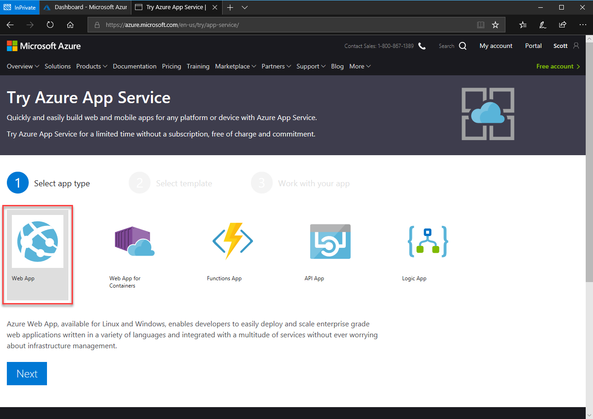

1.  Click Next.

Select the Template
-------------------

1.  In the Select template page, select Node.js Web App on Linux.

    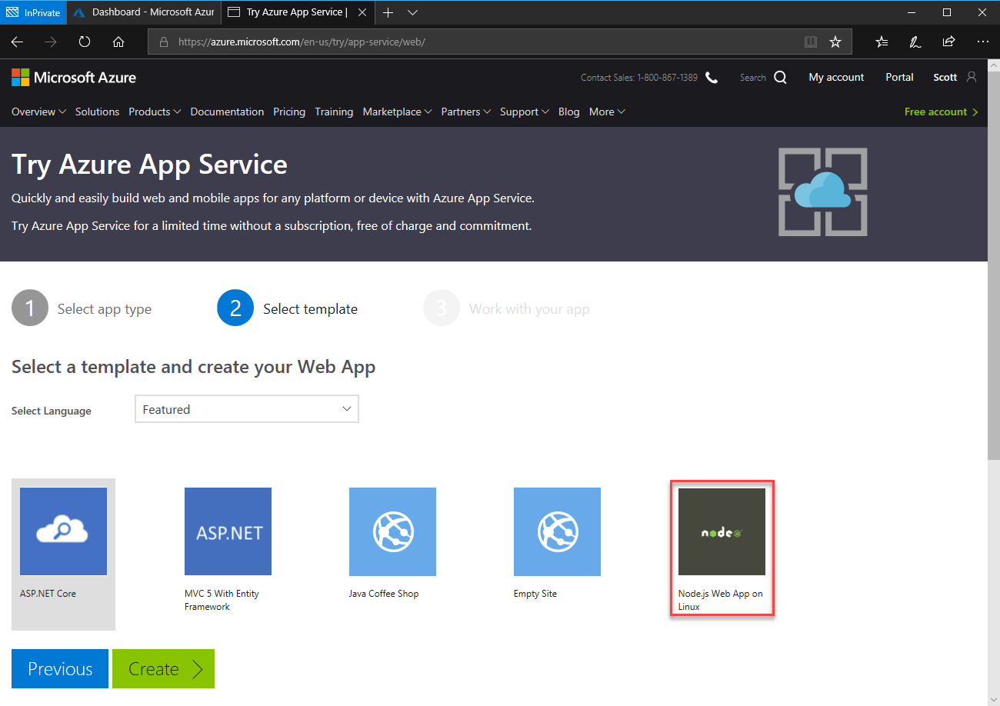

1.  Click Create.

1.  You will be prompted to provide your Microsoft account credentials.

1.  Once authenticated, the Work with your app page will appear.
    > NOTE: Currently, step 4 may take 1 to 2 minutes. Do not click the back button or reload the page.

1.  While holding down the Ctrl key, click on the new Web App link to open the
    app in a new browser tab.

    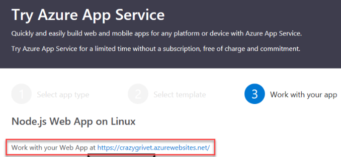

1.  The new Web App simply displays a welcome message, “Hello Azure!”.

1.  Do not close this tab.

    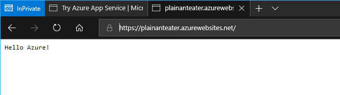

## Work with Your App

1.  Back on the Try Azure App Service tab, select the Clone or push with Git
    option.

    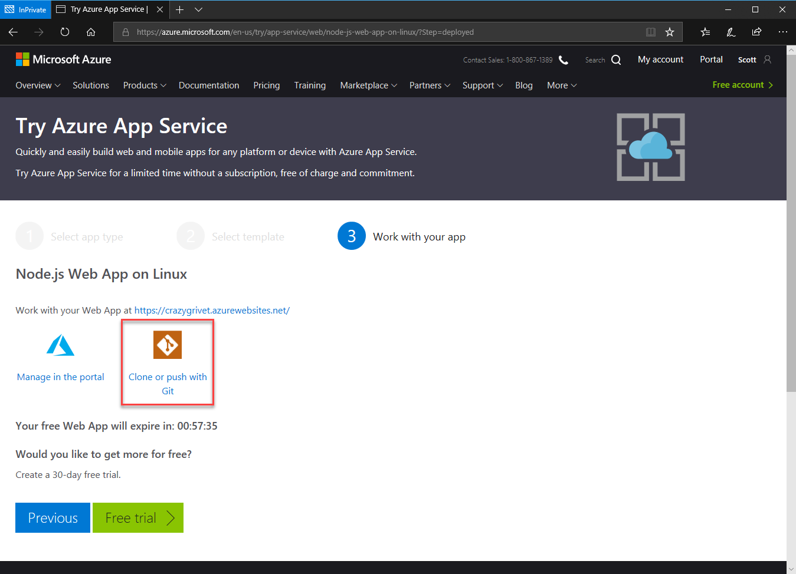

1.  Highlight and Copy the generated URL.

    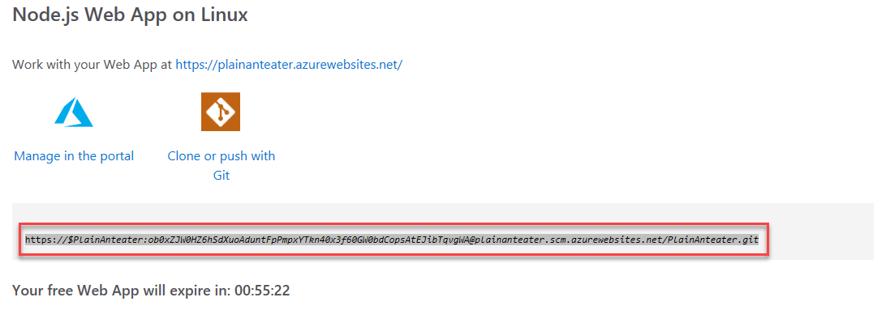

1.  Open a new Command Prompt, and navigate to a directory
    where you would like to clone this repository.

1.  Once in that directory, type in git clone, and then paste in the URL copied
    from the Work with your app page in the browser.

1.  Git will download the web app project into the current directory.

    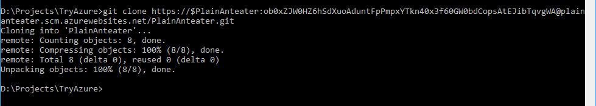

1.  Next, open up the Node.js web app project in Visual Studio code by typing in
    Code . (that is, the word Code followed by a space then a period), at the
    command prompt.

    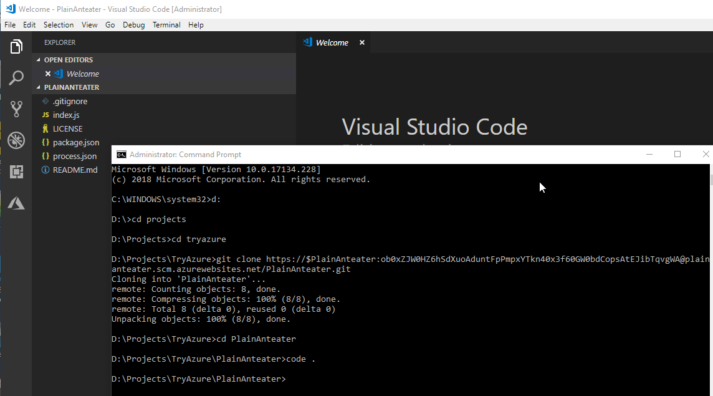

1.  Open the index.js file by selecting it in the Explorer window.

    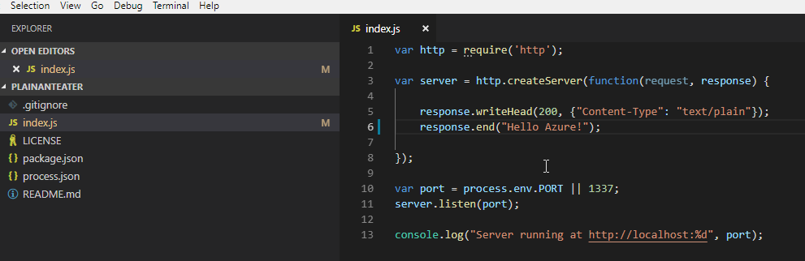

1.  In the index.js file, change “Hello Azure”, to “Hello Awesome Azure”.

1.  Now that a change has been made, the change needs to be deployed to Azure.

1.  Click the Source Control icon on the left (third icon from the top with a
    **1** on it).

1.  In the Source Control window, click on index.js in the Changes section.

1.  Git and Visual Studio Code track the changes. On the left is what is
    currently deployed, and on the right is the changes to be deployed.

1.  In the Source Control window, click the Stage Changes button (the + button).

    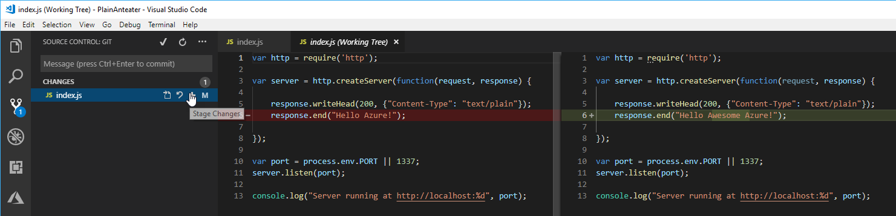

Deploying the Changes
---------------------

1.  With the changes staged, the changes can then be pushed and deployed. In the
    Source Control window, enter a message which describes the changes made, the
    click the Commit button (the checkmark) to commit the changes.

    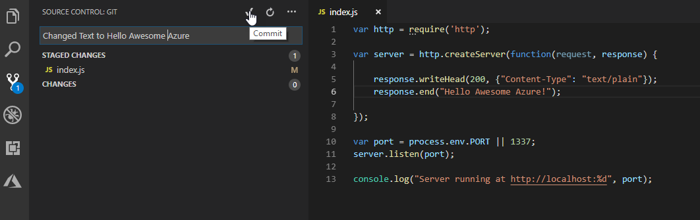

1.  Once the changes are committed, notice in the bottom left-hand corner of VS
    Code that it shows that there is 1 change ready to be deployed and pushed
    to Azure.

    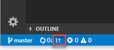

1.  Back in the Source Control button, click the ellipse button, and select Push
    from the menu. The changes are now being deployed to Azure.

    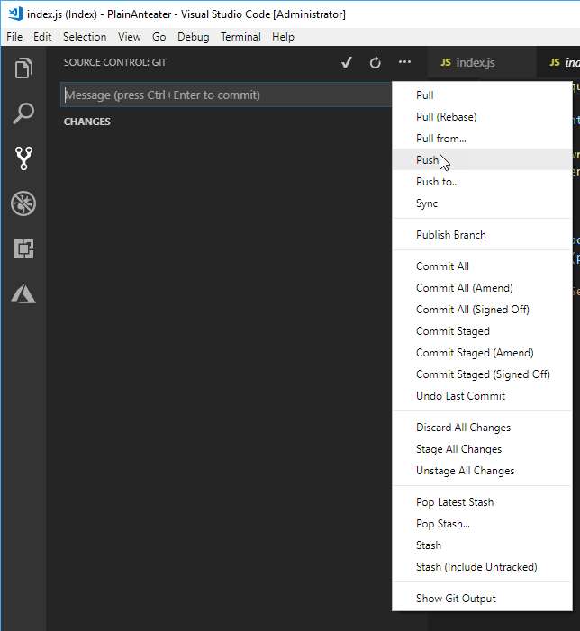

1.  During the deployment, again notice down in the left-hand corner of Visual
    Studio Code. The arrows spin as the deployment is made and once the
    deployment is finished, the status bar now shows no pending deployments.

    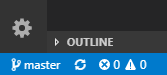

1.  With the deployment completed, go back to the web site tab and refresh the
    tab. Notice that the text now displays the modified text.

    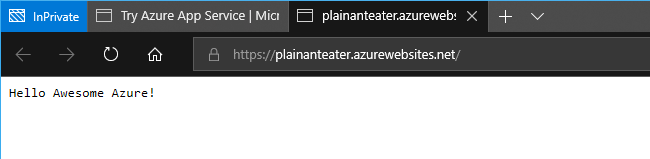
